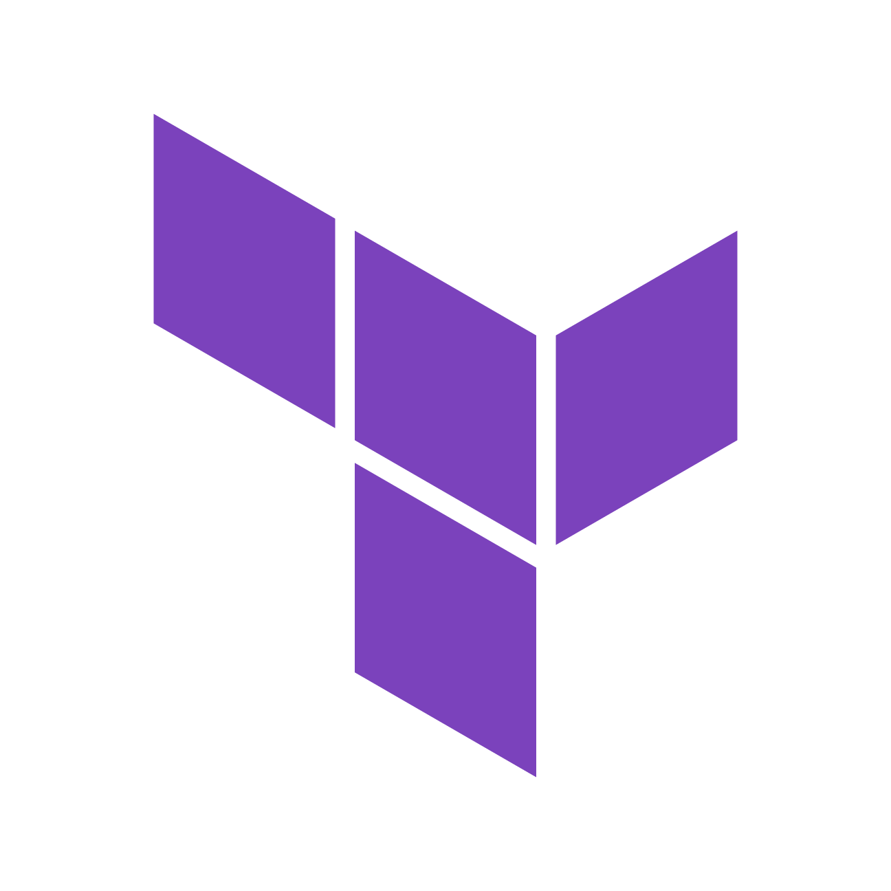

<a href="https://cloud.hashicorp.com/products/terraform">
    
</a>

# HCP Terraform Operator for Kubernetes

[](https://github.com/hashicorp/terraform-cloud-operator/releases)
[](https://hub.docker.com/r/hashicorp/terraform-cloud-operator)
[](https://github.com/hashicorp/terraform-cloud-operator/blob/main/LICENSE)

> **Warning**
> In upcoming releases, we shall proceed with renaming this project to HCP Terraform Operator for Kubernetes or simply HCP Terraform Operator. This measure is necessary in response to the recent announcement of [The Infrastructure Cloud](https://www.hashicorp.com/blog/introducing-the-infrastructure-cloud).
>
> The most noticeable change you can expect in version 2.6.0 is the renaming of this repository and related resources, such as the Helm chart and Docker Hub names.
>
> Please follow the changelogs for updates.

Kubernetes Operator allows managing HCP Terraform / Terraform Enterprise resources via Kubernetes Custom Resources.

> **Note**
> _From this point forward, the terms HCP Terraform can be used interchangeably with Terraform Enterprise in all documents, provided that the contrary is indicated._

The Operator can manage the following types of resources:

- `AgentPool` manages [HCP Terraform Agent Pools](https://developer.hashicorp.com/terraform/cloud-docs/agents/agent-pools), [HCP Terraform Agent Tokens](https://developer.hashicorp.com/terraform/cloud-docs/users-teams-organizations/api-tokens#agent-api-tokens) and can perform TFC agent scaling
- `Module` implements [API-driven Run Workflows](https://developer.hashicorp.com/terraform/cloud-docs/run/api)
- `Project` manages [HCP Terraform Projects](https://developer.hashicorp.com/terraform/cloud-docs/workspaces/organize-workspaces-with-projects)
- `Workspace` manages [HCP Terraform Workspaces](https://developer.hashicorp.com/terraform/cloud-docs/workspaces)

## Getting started

To get started see our tutorials on the HashiCorp Developer Portal:

- [HCP Terraform Operator for Kubernetes overview](https://developer.hashicorp.com/terraform/cloud-docs/integrations/kubernetes)
- [Deploy infrastructure with the HCP Terraform Operator for Kubernetes](https://developer.hashicorp.com/terraform/tutorials/kubernetes/kubernetes-operator-v2)
- [Manage agent pools with the HCP Terraform Operator for Kubernetes](https://developer.hashicorp.com/terraform/tutorials/kubernetes/kubernetes-operator-v2-agentpool)
- [HCP Terraform Operator for Kubernetes Migration Guide](https://developer.hashicorp.com/terraform/cloud-docs/integrations/kubernetes/ops-v2-migration)

## Documentation

### Supported Features

The full list of supported HCP Terraform Operator features can be found on our [Developer portal](https://developer.hashicorp.com/terraform/cloud-docs/integrations/kubernetes#supported-terraform-cloud-features).

### Installation

The Operator provides [Helm chart](./charts/terraform-cloud-operator) as a first-class method of installation on Kubernetes.

Three simple commands to install the Operator:

```console
$ helm repo add hashicorp https://helm.releases.hashicorp.com
$ helm repo update
$ helm install demo hashicorp/terraform-cloud-operator --wait --version 2.4.1
```

More detailed information about the installation and available values can be found [here](./charts/terraform-cloud-operator/README.md).

### Usage

General usage documentation can be found [here](./docs/usage.md).

Controllers usage guides:

- [AgentPool](./docs/agentpool.md)
- [Module](./docs/module.md)
- [Project](./docs/project.md)
- [Workspace](./docs/workspace.md)

Annotations and Labels used by HCP Terraform Operator can be found [here](./docs/annotations-and-labels.md).

### Metrics

The Operator exposes metrics in the [Prometheus](https://prometheus.io/) format for each controller. More information can be found [here](./docs/metrics.md).

### API reference

API reference documentation can be found [here](./docs/api-reference.md).

### Frequently Asked Questions

FAQ can be found [here](./docs/faq.md).

### Examples

YAML manifests examples live [here](./docs/examples/).

### Community Contribution

If you come across articles, videos, how-tos, or any other resources that could assist individuals in adopting and utilizing the operator with greater efficiency, kindly inform us by initiating a [pull request](https://github.com/hashicorp/terraform-cloud-operator/pulls) and placing a link within this designated section.

Your participation matters. Thank you for being a part of our community! :raised_hands:

## Troubleshooting

If you encounter any issues with the Operator there are a number of ways how to troubleshoot it:

- check the Operator logs:

    ```console
    $ kubectl logs -f <POD_NAME>
    ```

    Logs for a specific CR can be identified with the following pattern:

    ```json
    {"<KIND>": "<NAMESPACE>/<METADATA.NAME>", "msg": "..."}
    ```

    For example:

    ```text
    2023-01-05T12:11:31Z INFO Agent Pool Controller	{"agentpool": "default/this", "msg": "successfully reconcilied agent pool"}
    ```

- check the CR:

    ```console
    $ kubectl get agentpool <NAME>
    $ kubectl get module <NAME>
    $ kubectl get project <NAME>
    $ kubectl get workspace <NAME>
    ```

- check the CR events:

    ```console
    $ kubectl describe agentpool <NAME>
    $ kubectl describe module <NAME>
    $ kubectl describe project <NAME>
    $ kubectl describe workspace <NAME>
    ```

If you believe you've found a bug and cannot find an existing issue, feel free to open a new issue! Be sure to include as much information as you can about your environment.

## Contributing to the Operator

We appreciate your enthusiasm for participating in the development of the HCP Terraform Operator. To contribute, please read the [contribution guidelines](./CONTRIBUTING.md).

## Security Reporting

If you think you've found a security vulnerability, we'd love to hear from you.

Follow the instructions in [SECURITY.md](.github/SECURITY.md) to make a report.
